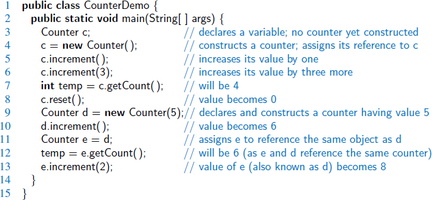

새 객체는 메모리에 동적으로 할당되고 모든 인스턴스 변수는 표준 기본값으로 초기화됩니다

Default value init
참조 변수 == null
boolean == false

메서드 선언
 signature 
   - 메서드의 이름과 매개변수
 body
  - 수행하는 작업을 정의

반환 유형

매개변수
Java의 모든 매개변수는 값으로 전달
메서드에 매개변수를 전달할 때마다 해당 매개변수의 복사본이 만들어지고 메서드 본문에서 사용됩니다. 
모두 같은 객체를 참조하는 여러 변수가 있을 수 있다는 점을 기억하세요. 메서드 내부에서 내부 참조 변수를 다시 할당해도 전달된 참조는 변경되지 않습니다

Java를 다른 언어와 비교하기
이 섹션에서는 Java 플랫폼과 여러분에게 친숙한 다른 프로그래밍 환경 간의 몇 가지 차이점을 간략하게 살펴보겠습니다.

자바스크립트와 자바스크립트 비교
Java는 정적으로 타입이 지정되고 JavaScript는 동적으로 타입이 지정됩니다.

Java는 클래스 기반 객체를 사용하는 반면 JavaScript는 프로토타입 기반입니다(JS 키워드는 class구문적 편의를 제공합니다).

Java는 좋은 객체 캡슐화를 제공하지만 JavaScript는 그렇지 않습니다.

Java에는 네임스페이스가 있지만 JavaScript에는 없습니다.

Java는 멀티스레드이지만 JavaScript는 그렇지 않습니다.

자바와 파이썬 비교
Java는 정적으로 타입이 지정되고 Python은 동적 타입이 지정됩니다(선택적으로 점진적인 타입 지정 가능).

Java는 함수형 프로그래밍(FP) 기능을 갖춘 OO 언어이고, Python은 일부 FP를 지원하는 하이브리드 OO/절차적 언어입니다.

Java와 Python은 모두 바이트코드 형식을 가지고 있습니다. Java는 JVM 클래스 파일을 사용하고 Python은 Python 바이트코드를 사용합니다.

Java의 바이트코드는 광범위한 정적 검사를 제공하지만 Python의 바이트코드는 그렇지 않습니다.

Java는 멀티스레드인 반면 Python은 한 번에 하나의 스레드만 Python 바이트코드를 실행하도록 허용합니다(Global Interpreter Lock).

Java와 C의 비교
자바는 객체 지향 언어이고, C는 절차적 언어입니다.

Java는 클래스 파일로 이식이 가능하지만 C는 다시 컴파일해야 합니다.

Java는 런타임의 일부로 광범위한 계측 기능을 제공합니다.

자바에는 포인터가 없고 포인터 산술과 동등한 것도 없습니다.

Java는 가비지 수집을 통해 자동 메모리 관리를 제공합니다.

현재 Java에서는 낮은 수준에서 메모리를 배치할 수 있는 기능이 없습니다(구조체 없음).

자바에는 전처리기가 없습니다.

Java와 C++ 비교
Java는 C++에 비해 단순화된 객체 모델을 가지고 있습니다.

Java의 메서드 디스패치는 기본적으로 가상입니다.

Java는 항상 값 전달 방식입니다(하지만 Java 값에 대한 유일한 가능성 중 하나는 객체 참조입니다).

Java는 완전한 다중 상속을 지원하지 않습니다.

Java의 제네릭은 C++ 템플릿보다 덜 강력하지만 덜 위험합니다.

자바에는 연산자 오버로딩이 없습니다.

자바에 대한 몇 가지 비판에 대한 답변
자바는 대중의 눈에 오랜 역사를 가지고 있으며, 그 결과 수년에 걸쳐 상당한 비판을 받았습니다. 이러한 부정적인 언론의 일부는 일부 기술적 단점과 자바의 첫 번째 버전에서 다소 지나치게 열성적인 마케팅이 결합된 데 기인할 수 있습니다.

그러나 일부 비판은 더 이상 정확하지 않음에도 불구하고 기술적 민속에 들어갔습니다. 이 섹션에서는 몇 가지 일반적인 불평과 현대 버전의 플랫폼에 대한 불평이 어느 정도 사실인지 살펴보겠습니다.

# collections-course
Examples of Java Collections framework to Digital Innovation One course.
